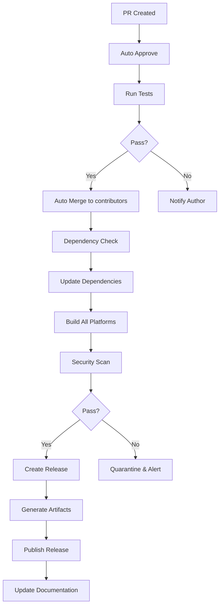

<div align="center">

# 🔧 Ultimate Installer

**The Universal Cross-Platform Development Environment Installer**

[](https://deno.land)
[](https://www.typescriptlang.org)
[](LICENSE)
[](https://github.com/ProjectZeroDays/ultimate_installer/actions)
[]()
[]()

[Installation](#installation) • [Documentation](docs/) • [Contributing](CONTRIBUTING.md) • [Changelog](CHANGELOG.md) • [Security](SECURITY.md)

</div>

---

## 📋 Table of Contents

- [Overview](#overview)
- [Features](#features)
- [Supported Platforms](#supported-platforms)
- [Installation](#installation)
- [Quick Start](#quick-start)
- [Usage](#usage)
- [Configuration](#configuration)
- [Modules](#modules)
- [CI/CD & Automation](#cicd--automation)
- [Architecture](#architecture)
- [Development](#development)
- [Contributing](#contributing)
- [Security](#security-1)
- [License](#license)

---

## 🎯 Overview

**Ultimate Installer** is a comprehensive, cross-platform development environment setup tool designed to work across **50+ operating systems** and environments. From traditional Linux distributions to mobile environments (Termux, iSH), embedded systems, and exotic platforms, Ultimate Installer provides a unified interface for installing development tools, security research utilities, and system configurations.

### Why Ultimate Installer?

- **Universal Compatibility**: Works on everything from Ubuntu to SerenityOS
- **Single Binary**: Compile to standalone executables for each platform
- **Intelligent Detection**: Automatically detects your OS, distribution, and architecture
- **Modular Design**: Install only what you need, when you need it
- **Production Ready**: Enterprise-grade CI/CD, automated testing, and security auditing

---

## ✨ Features

### Core Capabilities

| Feature | Description | Status |
|---------|-------------|--------|
| **50+ Platforms** | Support for mainstream, mobile, embedded, and exotic OS | ✅ Complete |
| **Package Manager Abstraction** | Unified interface for apt, dnf, pacman, apk, pkg, and more | ✅ Complete |
| **Modular Architecture** | Install individual components or full suites | ✅ Complete |
| **Mobile Development** | Full Termux (Android) and iSH (iOS) support | ✅ Complete |
| **Security Toolkit** | Comprehensive penetration testing and research tools | ✅ Complete |
| **Privacy Tools** | Anonymization, encryption, and privacy utilities | ✅ Complete |
| **Forensics Suite** | Digital forensics and incident response tools | ✅ Complete |
| **Embedded Support** | Raspberry Pi, IoT devices, and embedded systems | ✅ Complete |
| **Network Tools** | Advanced networking and protocol analysis | ✅ Complete |
| **Auto-Updates** | Self-updating capability and dependency management | ✅ Complete |

### Platform Categories

<details>
<summary><b>🐧 Linux Distributions (25+)</b></summary>

- **Debian-based**: Debian, Ubuntu, Mint, Pop!_OS, Zorin, Elementary, Kodachi, Parrot, Kali
- **Arch-based**: Arch, Manjaro, BlackArch, Garuda, EndeavourOS
- **RHEL-based**: Fedora, CentOS, RHEL, Rocky, Alma
- **Independent**: Alpine, Gentoo, Slackware, Solus, Void, NixOS, Guix
- **Mobile Linux**: Mobian, postmarketOS, Plasma Mobile, Ubuntu Touch

</details>

<details>
<summary><b>📱 Mobile & Embedded (15+)</b></summary>

- **Android**: Termux, KaiOS
- **iOS**: iSH (Alpine-based)
- **Embedded**: Raspberry Pi, Raspbian, OpenWrt, OPNsense, pfSense
- **Specialized**: Tails, Qubes, CubooS, Porteus, SailfishOS, webOS

</details>

<details>
<summary><b>🖥️ BSD & Unix (10+)</b></summary>

- **BSD**: FreeBSD, OpenBSD, NetBSD, GhostBSD, TrueNAS
- **Unix**: OpenIndiana, MINIX, Haiku, Redox, SerenityOS

</details>

<details>
<summary><b>🪟 Other Platforms (10+)</b></summary>

- **Windows**: Native, WSL, ReactOS
- **macOS**: Intel, Apple Silicon
- **ChromeOS**: Crostini, Brunch
- **Gaming**: SteamOS (planned)

</details>

---

## 💻 Supported Platforms

### Detailed Platform Matrix

| Platform | Architecture | Package Manager | Status | Notes |
|----------|-------------|-----------------|--------|-------|
| **Linux** | | | | |
| Ubuntu | x64, ARM64 | apt | ✅ Supported | 20.04+ |
| Debian | x64, ARM64 | apt | ✅ Supported | 10+ |
| Arch Linux | x64, ARM64 | pacman | ✅ Supported | Rolling |
| Fedora | x64, ARM64 | dnf | ✅ Supported | 35+ |
| Kali Linux | x64, ARM64 | apt | ✅ Supported | Security focused |
| BlackArch | x64 | pacman | ✅ Supported | Penetration testing |
| Parrot OS | x64 | apt | ✅ Supported | Security & privacy |
| Alpine | x64, ARM64 | apk | ✅ Supported | Lightweight |
| NixOS | x64 | nix | ✅ Supported | Declarative |
| **Mobile** | | | | |
| Termux (Android) | ARM64, ARM | pkg | ✅ Supported | Android 7+ |
| iSH (iOS) | ARM64 | apk | ✅ Supported | iOS 12+ |
| **BSD** | | | | |
| FreeBSD | x64 | pkg | ✅ Supported | 13+ |
| OpenBSD | x64 | pkg_add | ✅ Supported | 7+ |
| NetBSD | x64 | pkgin | ✅ Supported | 9+ |
| **Other** | | | | |
| macOS | x64, ARM64 | brew | ✅ Supported | 11+ |
| Windows | x64 | winget/choco | ✅ Supported | 10/11 |
| ChromeOS | x64 | apt | ✅ Supported | Crostini |

---

## 🚀 Installation

### Method 1: Pre-built Binary (Recommended)

Download the latest release for your platform:

```bash
# Linux (x64)
curl -fsSL https://github.com/ProjectZeroDays/ultimate_installer/releases/latest/download/ultimate-installer-linux-x64 -o ultimate-installer
chmod +x ultimate-installer
sudo mv ultimate-installer /usr/local/bin/

# macOS (Apple Silicon)
curl -fsSL https://github.com/ProjectZeroDays/ultimate_installer/releases/latest/download/ultimate-installer-macos-arm64 -o ultimate-installer
chmod +x ultimate-installer
sudo mv ultimate-installer /usr/local/bin/

# Windows (PowerShell)
Invoke-WebRequest -Uri "https://github.com/ProjectZeroDays/ultimate_installer/releases/latest/download/ultimate-installer-windows-x64.exe" -OutFile "ultimate-installer.exe"
Move-Item .\ultimate-installer.exe $env:LOCALAPPDATA\Microsoft\WindowsApps\
```

### Method 2: Install Script

```bash
# Unix/Linux/macOS
curl -fsSL https://raw.githubusercontent.com/ProjectZeroDays/ultimate_installer/main/scripts/install.sh | bash

# Windows (PowerShell)
Invoke-WebRequest -Uri "https://raw.githubusercontent.com/ProjectZeroDays/ultimate_installer/main/scripts/install.ps1" -UseBasicParsing | Invoke-Expression
```


### Mobile Installation Scripts

For Android (Termux) and iOS (iSH), use the specialized install scripts:

**Android (Termux):**
```bash
curl -fsSL https://raw.githubusercontent.com/ProjectZeroDays/ultimate_installer/main/scripts/install-termux.sh | bash
```

**iOS (iSH):**
```bash
curl -fsSL https://raw.githubusercontent.com/ProjectZeroDays/ultimate_installer/main/scripts/install-ish.sh | sh
```

These scripts handle the specific requirements of mobile environments including:
- Architecture detection (ARM64, ARM, x86_64)
- Mobile-optimized binary selection
- Proper permission handling for sandboxed environments

### Method 3: Build from Source

```bash
# Clone repository
git clone https://github.com/ProjectZeroDays/ultimate_installer.git
cd ultimate_installer

# Install Deno (if not installed)
curl -fsSL https://deno.land/install.sh | sh

# Run directly
deno task start

# Or compile to binary
deno task compile
```

### Method 4: Package Managers

```bash
# Homebrew (macOS/Linux)
brew tap projectzerodays/tap
brew install ultimate-installer

# Scoop (Windows)
scoop bucket add projectzerodays
scoop install ultimate-installer

# Cargo (Rust)
cargo install ultimate-installer
```

---

## ⚡ Quick Start

### Basic Usage

```bash
# Install all default components
ultimate-installer install

# Install specific module
ultimate-installer install --module devtools

# Install multiple modules
ultimate-installer install --module core,devtools,security

# Dry run (see what would be installed)
ultimate-installer install --dry-run

# Interactive mode
ultimate-installer install --interactive
```

### Platform-Specific Examples

**Android (Termux):**
```bash
pkg install wget
wget https://github.com/ProjectZeroDays/ultimate_installer/releases/latest/download/ultimate-installer-android
chmod +x ultimate-installer-android
./ultimate-installer-android install --module mobile-dev
```

**iOS (iSH):**
```bash
wget https://github.com/ProjectZeroDays/ultimate_installer/releases/latest/download/ultimate-installer-ish
chmod +x ultimate-installer-ish
./ultimate-installer-ish install --module core
```

**Docker:**
```bash
docker run -it --rm projectzerodays/ultimate-installer:latest install
```

---

## 📖 Usage

### Commands

```
ultimate-installer <command> [options]

Commands:
  install [options]     Install components and tools
  uninstall [options]   Remove installed components
  list [options]        List available components
  update [options]      Update package lists and tools
  search <query>        Search for available packages
  info [component]      Show detailed component information
  doctor                Diagnose installation issues
  config [action]       Manage configuration
  completions [shell]   Generate shell completions
  version               Show version information
  help [command]        Show help for a command

Global Options:
  -v, --verbose         Enable verbose output
  -q, --quiet           Suppress non-error output
  --no-color            Disable colored output
  --config <path>       Use custom configuration file
  -h, --help            Show help
  --version             Show version
```

### Install Command

```bash
# Install with specific options
ultimate-installer install \
  --module core,devtools \
  --distribution ubuntu \
  --architecture x64 \
  --yes \
  --verbose

# Install from custom repository
ultimate-installer install \
  --from https://github.com/custom/repo \
  --branch develop
```

### Configuration Management

```bash
# View current configuration
ultimate-installer config get

# Set configuration value
ultimate-installer config set install.path /opt/tools

# Reset to defaults
ultimate-installer config reset

# Validate configuration
ultimate-installer config validate
```

### System Diagnostics

```bash
# Run system diagnostics
ultimate-installer doctor

# Check specific component
ultimate-installer doctor --component devtools

# Fix common issues
ultimate-installer doctor --fix
```

---

## ⚙️ Configuration

### Configuration Files

Ultimate Installer uses a hierarchical configuration system:

1. **Built-in defaults** (lowest priority)
2. **System configuration** (`/etc/ultimate-installer/config.yaml`)
3. **User configuration** (`~/.config/ultimate-installer/config.yaml`)
4. **Project configuration** (`./.ultimate-installer.yaml`)
5. **Environment variables** (highest priority)

### Example Configuration

```yaml
# ~/.config/ultimate-installer/config.yaml
version: "1.0"

# Installation preferences
install:
  path: "${HOME}/.local/share/ultimate-installer"
  parallel: true
  max_concurrent: 4
  verify_checksums: true
  backup_existing: true

# Module configuration
modules:
  core:
    auto_update: true
    packages:
      - git
      - curl
      - wget
      - vim

  devtools:
    languages:
      - python
      - node
      - rust
      - go
    editors:
      - vscode
      - vim

  security:
    tools:
      - nmap
      - metasploit
      - wireshark
    enable_experimental: false

# Platform-specific overrides
platforms:
  android:
    install:
      path: "/data/data/com.termux/files/usr"

  ios:
    install:
      path: "/usr/local"

# Mirrors and repositories
repositories:
  primary: "https://github.com/ProjectZeroDays/ultimate_installer"
  mirrors:
    - "https://gitlab.com/projectzerodays/ultimate_installer"
    - "https://codeberg.org/projectzerodays/ultimate_installer"

# Logging
logging:
  level: info
  file: "${HOME}/.local/share/ultimate-installer/logs/installer.log"
  max_size: 100MB
  max_files: 5
```

### Environment Variables

| Variable | Description | Example |
|----------|-------------|---------|
| `UI_CONFIG_PATH` | Custom config file path | `/path/to/config.yaml` |
| `UI_INSTALL_PATH` | Installation directory | `/opt/tools` |
| `UI_LOG_LEVEL` | Logging level | `debug` |
| `UI_PARALLEL` | Enable parallel installs | `true` |
| `UI_OFFLINE` | Offline mode | `false` |
| `UI_MIRROR` | Use specific mirror | `https://mirror.example.com` |

---

## 🧩 Modules

### Available Modules

| Module | ID | Description | Platforms |
|--------|-----|-------------|-----------|
| **Core** | `core` | Essential system tools | All |
| **Development** | `devtools` | Programming languages & IDEs | All |
| **Security** | `security` | Penetration testing tools | Linux, macOS |
| **Privacy** | `privacy` | Anonymization & encryption | All |
| **Forensics** | `forensics` | Digital forensics tools | Linux, macOS |
| **Mobile Dev** | `mobile-dev` | Mobile development tools | Android, iOS |
| **Embedded** | `embedded` | IoT & embedded tools | Linux |
| **Network** | `network` | Advanced networking tools | All |

### Module Details

#### Core Module

Essential tools for any development environment:

- **System**: git, curl, wget, tar, unzip
- **Editors**: vim, nano, micro
- **Shells**: zsh, fish, bash enhancements
- **Tools**: htop, tmux, fzf, ripgrep, fd

#### Development Tools Module

Programming languages and development environments:

- **Languages**: Python, Node.js, Go, Rust, Ruby, Java, Kotlin, Swift
- **Package Managers**: pip, npm, yarn, cargo, gem, gradle
- **IDEs**: VS Code, JetBrains tools, Vim/Neovim
- **Databases**: PostgreSQL, MySQL, MongoDB, Redis
- **Containers**: Docker, Podman, Kubernetes tools

#### Security Research Module

Comprehensive security testing toolkit:

- **Reconnaissance**: nmap, masscan, amass, subfinder
- **Web**: nikto, sqlmap, burp-suite, zap
- **Wireless**: aircrack-ng, wifite, kismet
- **Exploitation**: metasploit, searchsploit, exploitdb
- **Forensics**: volatility, sleuthkit, autopsy
- **Reverse Engineering**: ghidra, radare2, binwalk

#### Privacy Module

Privacy and anonymity tools:

- **Network**: tor, i2p, VPN clients
- **Encryption**: gpg, veracrypt, cryptsetup
- **Communication**: signal-cli, wire-cli
- **OSINT**: sherlock, theharvester, maltego

---

## 🔄 CI/CD & Automation

Ultimate Installer features a comprehensive, fully automated CI/CD pipeline that handles everything from code validation to release distribution.

### Workflow Overview



### Automated Workflows

#### 1. Pull Request Automation

**Auto Approval** (`.github/workflows/auto-approve.yml`):
- Automatically approves PRs that:
  - Pass all status checks
  - Have required reviews
  - No merge conflicts
  - No security vulnerabilities

**Auto Merge** (`.github/workflows/auto-merge.yml`):
- Merges approved PRs to `contributors` branch
- Maintainers manually merge `contributors` → `main`
- Squash merge with conventional commit format

#### 2. Dependency Automation

**Dependency Update** (`.github/workflows/dependency-update.yml`):
- Daily checks for Deno module updates
- Weekly checks for GitHub Actions updates
- Creates PRs with update details
- Auto-merges if tests pass

#### 3. Build & Test

**Continuous Integration** (`.github/workflows/ci.yml`):
- Linting (deno lint, format check)
- Type checking (deno check)
- Unit tests (deno test)
- Integration tests
- Coverage reporting

#### 4. Security

**Security Scanning** (`.github/workflows/security.yml`):
- Dependency vulnerability scanning
- Secret detection
- Static analysis
- Container scanning

#### 5. Release Automation

**Release** (`.github/workflows/release.yml`):
- Triggered on push to `main` or dependency updates
- Builds for all 50+ platforms
- Generates release notes
- Creates GitHub Release with artifacts
- Updates homebrew/scoop taps

### Artifact Generation

Each release includes:

| Artifact | Description | Platforms |
|----------|-------------|-----------|
| `ultimate-installer-{platform}` | Compiled binary | All |
| `ultimate-installer-{platform}.zip` | Zipped binary | All |
| `install.sh` | Unix install script | Linux, macOS, BSD |
| `install.ps1` | PowerShell install script | Windows |
| `checksums.txt` | SHA256 checksums | All |
| `sbom.json` | Software Bill of Materials | All |

### Release Channels

| Channel | Trigger | Stability | Auto-update |
|---------|---------|-----------|-------------|
| `stable` | Tag push | Production | Yes |
| `beta` | PR merge | Pre-release | Opt-in |
| `nightly` | Daily cron | Development | Opt-in |
| `canary` | Every commit | Bleeding edge | No |

---

## 🏗️ Architecture

### System Architecture

```
┌─────────────────────────────────────────────────────────────┐
│                    CLI Interface                            │
│  (install, update, list, search, doctor, config, etc.)     │
└──────────────────────┬──────────────────────────────────────┘
                       │
┌──────────────────────▼──────────────────────────────────────┐
│                  Command Router                             │
│         (Argument parsing, validation, help)               │
└──────────────────────┬──────────────────────────────────────┘
                       │
        ┌──────────────┼──────────────┐
        │              │              │
┌───────▼──────┐ ┌────▼─────┐ ┌──────▼───────┐
│   Platform   │ │  Config  │ │   Modules    │
│   Detection  │ │  Manager │ │   Registry   │
└───────┬──────┘ └────┬─────┘ └──────┬───────┘
        │             │              │
        └─────────────┼──────────────┘
                      │
┌─────────────────────▼───────────────────────────────────────┐
│                  Core Engine                                │
│  (Package Manager, Downloader, Installer, Validator)       │
└─────────────────────┬───────────────────────────────────────┘
                      │
        ┌─────────────┼─────────────┐
        │             │             │
┌───────▼─────┐ ┌────▼────┐ ┌──────▼──────┐
│   Package   │ │  Shell  │ │   Network   │
│   Managers  │ │  Exec   │ │   Utils     │
└─────────────┘ └─────────┘ └─────────────┘
```

### Module System

```typescript
// Example module structure
interface Module {
  id: string;
  name: string;
  version: string;
  platforms: Platform[];
  dependencies: string[];

  detect(): Promise<boolean>;
  install(options: InstallOptions): Promise<void>;
  uninstall(): Promise<void>;
  update(): Promise<void>;
}
```

### Platform Detection Flow

1. **OS Detection**: Check `Deno.build.os` and environment variables
2. **Distribution Detection**: Parse `/etc/os-release`, check specific files
3. **Architecture Detection**: `uname -m`, `process.arch`
4. **Environment Detection**: Container, WSL, VM, mobile
5. **Package Manager Detection**: Check for available package managers
6. **Capability Detection**: Root access, sudo, available tools

---

## 🛠️ Development

### Prerequisites

- [Deno](https://deno.land) 1.40.0+
- [Git](https://git-scm.com) 2.30+
- [Make](https://www.gnu.org/software/make/) (optional)

### Setup

```bash
# Clone repository
git clone https://github.com/ProjectZeroDays/ultimate_installer.git
cd ultimate_installer

# Install dependencies
deno cache --reload src/main.ts

# Run in development mode
deno task dev

# Run tests
deno task test

# Run with specific flags
deno task start -- install --dry-run --verbose
```

### Build Commands

```bash
# Compile for current platform
deno task compile

# Compile for all platforms
deno task compile:all

# Compile for specific platform
deno task compile:linux-x64
deno task compile:macos-arm64
deno task compile:windows-x64

# Create release artifacts
deno task release
```

### Testing

```bash
# Run all tests
deno task test

# Run unit tests only
deno task test:unit

# Run integration tests
deno task test:integration

# Run with coverage
deno task test:coverage

# Run specific test file
deno test tests/unit/core/platform.test.ts
```

### Project Structure

```
ultimate_installer/
├── .github/           # GitHub Actions, templates
├── config/            # Configuration schemas
├── docs/              # Documentation
├── scripts/           # Build and utility scripts
├── src/
│   ├── commands/      # CLI commands
│   ├── config/        # Configuration management
│   ├── core/          # Core engine
│   ├── modules/       # Installable modules
│   ├── platforms/     # Platform detection/handling
│   ├── utils/         # Utility functions
│   └── types/         # TypeScript definitions
├── tests/             # Test suites
└── types/             # Global type definitions
```

---

## 🤝 Contributing

We welcome contributions from the community! Please see our [Contributing Guide](CONTRIBUTING.md) for details.

### Quick Contributing Guide

1. **Fork** the repository
2. **Create** a feature branch (`git checkout -b feature/amazing-feature`)
3. **Commit** your changes (`git commit -m 'Add amazing feature'`)
4. **Push** to the branch (`git push origin feature/amazing-feature`)
5. **Open** a Pull Request

### Contribution Areas

- 🐛 **Bug Fixes**: Fix issues and edge cases
- ✨ **New Platforms**: Add support for new operating systems
- 📦 **New Modules**: Create new installation modules
- 📝 **Documentation**: Improve docs and examples
- 🧪 **Tests**: Add test coverage
- 🎨 **UI/UX**: Improve user interface

### Code Standards

- TypeScript strict mode enabled
- Follow existing code style (enforced by deno fmt)
- Add tests for new features
- Update documentation
- Use conventional commits

---

## 🔒 Security

### Security Features

- **Signed Releases**: All binaries signed with GPG
- **Checksum Verification**: SHA256 checksums for all artifacts
- **SBOM Generation**: Software Bill of Materials for each release
- **Dependency Scanning**: Automated vulnerability scanning
- **Secret Detection**: Prevents accidental secret commits
- **Sandboxed Execution**: Isolated installation processes

### Reporting Vulnerabilities

Please report security vulnerabilities to security@projectzerodays.com. See [SECURITY.md](SECURITY.md) for details.

### Security Audit

```bash
# Run security audit
ultimate-installer doctor --security

# Check for known vulnerabilities
ultimate-installer audit

# Verify installation integrity
ultimate-installer verify
```

---

## 📄 License

This project is licensed under the MIT License - see the [LICENSE](LICENSE) file for details.

---

## 🙏 Acknowledgments

- [Deno](https://deno.land) - The modern runtime for JavaScript and TypeScript
- [Cliffy](https://cliffy.io) - Command line framework for Deno
- All contributors who have helped shape this project

---

<div align="center">

**[⬆ Back to Top](#-ultimate-installer)**

Made with ❤️ by [Project Zero Days](https://github.com/ProjectZeroDays)

</div>
